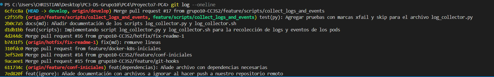
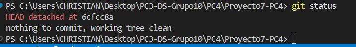
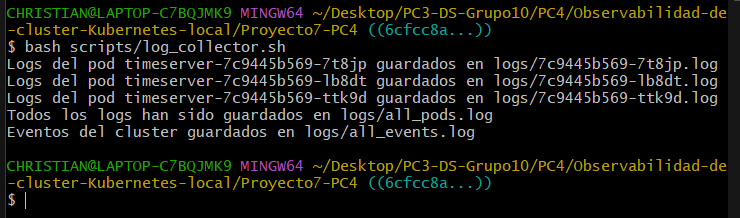
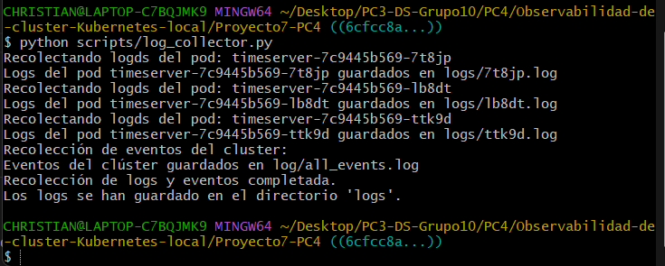
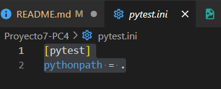
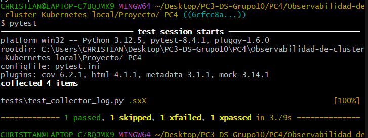

# Práctica Calificada 4

## Estudiante
Christian Giovanni Luna Jaramillo

## Correo Institucional
christian.luna.j@uni.pe

## Número de Proyecto
Proyecto 7

## Título del proyecto grupal
Observabilidad de clúster Kubernetes local (mini-monitoring)

## URL - Repositorio Grupal
https://github.com/grupo10-CC3S2/Proyecto7-PC4

## Descripción del rol
### Sprint 1
- Me encargué de crear scripts para recoger los logs de los Pods en un namespace específico y los eventos del Cluster (`log_collector.sh` y `log_collector.py`) para guardarlos en archivos locales además de implementar pruebas con marcas `xfail` o `skip` para casos donde no hay Pods disponibles `test_collector_log.py`

# Instrucciones de ejecución

## Sprint 1
Para esta primera parte del proyecto, lo que haremos será clonar el repositorio grupal sobre el que trabajamos, pero luego nos ubicaremos al último commit que realicé en ese repositorio, para verificar el funcionamiento de este, para ello lo primero que haremos será clonar el repositorio [Proyecto7-PC4](https://github.com/grupo10-CC3S2/Proyecto7-PC4) y entraremos en el repositorio
```bash
git clone https://github.com/grupo10-CC3S2/Proyecto7-PC4.git

cd Proyecto7-PC4
```
El hash del commit que para el sprint 1 usaremos, será `6cfcc8a` el cuál podemos verificar en la siguiente tabla, y en este caso será el último commit que tiene el repositorio


Así que para entrar a ese momento del historial de commits, ejecutaremos el comando `git checkout`
```bash
git checkout 6cfcc8a
```

Y con esto entraremos a un estado de detached, con lo cuál lo ideal es que cada cambio que hagamos, lo eliminemos a su estado base para no generar errores.
Ya estando en este momento del historial, procedemos a ejecutar los siguiente comandos
```bash
# Seguimos los pasos para levantar los Pods
# Construir imagen
docker build -t timeserver:latest app

# Desplegar pods
kubectl apply -f k8s/

# Comprobar que los pods corren
kubect get pods

# Para verificar que el servicio corre, ejecutar
```
Creamos el entorno virtual para instalar las dependencias que necesitamos
```bash
# Creando entorno virtual
python -m venv venv

# Entrar al entorno
# Powershell
.\venv\Scripts\activate
# Ubuntu
source venv/Scripts/activate

# Instalar requirements
pip install -r requirements.txt
```
### Probar scripts
Para esta parte, ejecutaremos todo en git bash, así que en caso se use Windows, ejecutar `git bash` pero en caso se use Ubuntu, dejar omitir ese comando.
#### log_collector.sh
```bash
bash scripts/log_collector.sh
```


Para probar el `log_collector.py` eliminamos la carpeta `logs` que se creó
```bash
rm -r logs/
```

#### log_collector.py
```bash
python scripts/log_collector.py
```


Lugo de ejecutar el comando, no es necesario eliminar la carpeta logs, porque con la prueba unitaria se eliminará, pero por si acaso ejecutamos el comando
```bash
rm -r logs/
```

#### pytest.ini
Para realizar las pruebas, debemos de tener nuestra configuración `pytest.ini` para saber desde donde comenzar a buscar los test y tener listo el entorno para las pruebas unitarias


#### test_collector_log.py
Como ya tenemos `pytest.ini` declarado, entonces solo ejecutaremos el comando `pytest`
```bash
pytest
```


Luego de realizar todos los pasos, elimamos los pods y la imagen y sería todo finalizado por mi parte para el **Sprint-1**
```bash
kubectl delete -f k8s
```
Luego de esperar unos segundos, ejecutar
```bash
docker image rm timeserver
```
Para volver al estado actual de `Proyecto7-PC4` solo ejecutamos el siguiente comando y ya no estaremos apuntando al commit seleccionado
```bash
git checkout main
```
Y con esto se acabaría toda mi constribución para el **Sprint-1**
